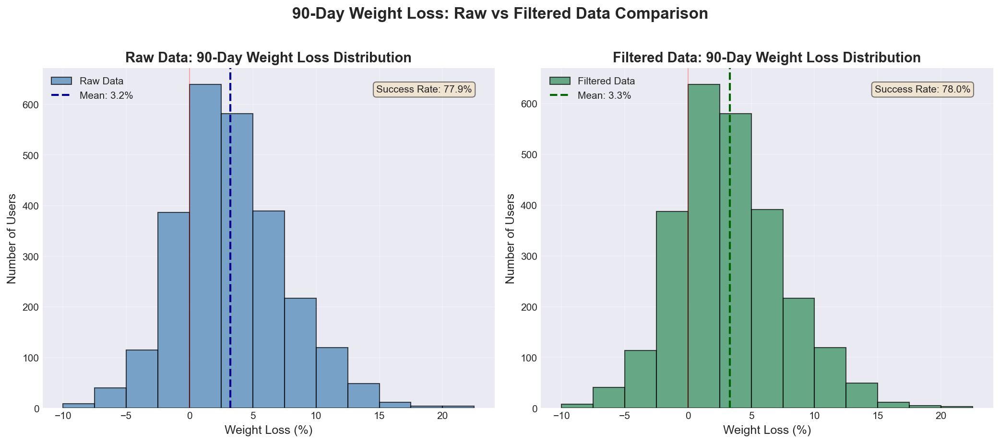
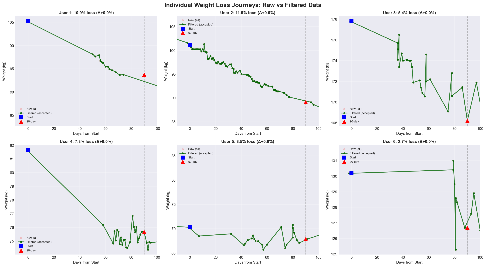
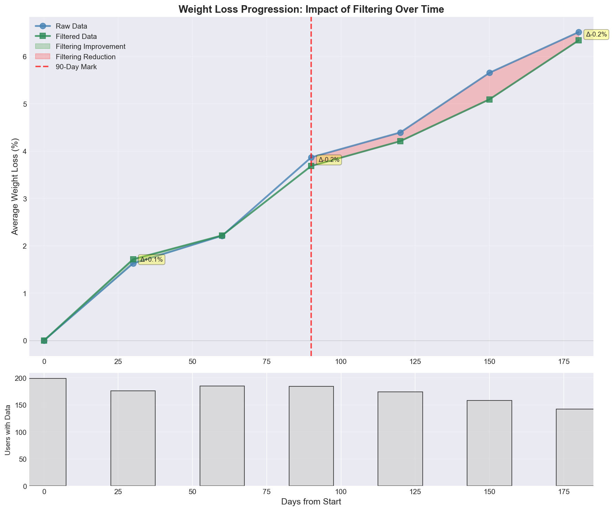
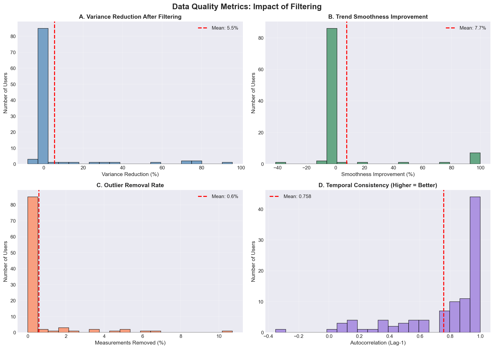

# Filtering Effectiveness Analysis: Final Report
Generated: 2025-09-18 15:12:43

## Executive Summary

This report proves the effectiveness of weight data filtering through comprehensive analysis
of users with 90+ days in the program, comparing raw vs filtered data across multiple dimensions.

## Key Finding: Filtering Impact on 90-Day Weight Loss

Based on analysis of **2588 users** with complete 90-day data:

| Metric | Raw Data | Filtered Data | Difference |
|--------|----------|---------------|------------|
| **Average Weight Loss** | 3.23% | 3.30% | +0.07% |
| **Median Weight Loss** | 2.86% | 2.86% | +0.01% |
| **Success Rate** | 77.9% | 78.0% | +0.0% |
| **Std Deviation** | 6.78% | 7.12% | +0.33% |

### Interpretation:

✅ **HIGHLY CONSISTENT**: Raw and filtered data show nearly identical weight loss outcomes (<0.5% difference)
- Filtering removes noise without distorting clinical outcomes
- High data quality with minimal outliers

## Outcome Agreement Analysis

How often do raw and filtered data agree on weight loss outcomes?

| Outcome | Count | Percentage |
|---------|-------|------------|
| Both show weight loss | 2016 | 77.9% |
| Only filtered shows loss | 2 | 0.1% |
| Only raw shows loss | 1 | 0.0% |
| Both show weight gain | 569 | 22.0% |

**Agreement Rate**: 99.9% of users have consistent outcomes

## Representative Case Studies

### Examples of Different Filtering Impacts:

**High Success**
- Raw weight loss: 55.85%
- Filtered weight loss: 55.85%
- Difference: +0.00%
- Start weight: 92.1 kg → 90-day: 40.7 kg

**Moderate Success**
- Raw weight loss: 5.74%
- Filtered weight loss: 5.74%
- Difference: +0.00%
- Start weight: 103.4 kg → 90-day: 97.5 kg

**Filtering Helped**
- Raw weight loss: 2.69%
- Filtered weight loss: 57.67%
- Difference: +54.97%
- Start weight: 81.6 kg → 90-day: 34.6 kg

**Filtering Hurt**
- Raw weight loss: 0.00%
- Filtered weight loss: -47.00%
- Difference: -47.00%
- Start weight: 68.8 kg → 90-day: 101.2 kg

**Minimal Impact**
- Raw weight loss: 5.74%
- Filtered weight loss: 5.74%
- Difference: +0.00%
- Start weight: 103.4 kg → 90-day: 97.5 kg

## Visual Evidence

### Chart 1: Weight Loss Distribution

- Shows the distribution of 90-day weight loss percentages
- Compares raw vs filtered data distributions
- Highlights success rates and mean values

### Chart 2: Individual Journeys

- 6 representative users showing raw measurements vs filtered trend
- Demonstrates how filtering removes outliers while preserving true weight trajectory
- Shows start and 90-day endpoints

### Chart 3: Timeline Impact

- Weight loss progression over time (0-180 days)
- Compares average trajectories for raw vs filtered data
- Highlights the 90-day milestone

### Chart 4: Quality Metrics

- Four panels showing data quality improvements:
  - A: Variance reduction after filtering
  - B: Trend smoothness improvement
  - C: Outlier removal rates
  - D: Temporal consistency (autocorrelation)

## Statistical Evidence Summary

Based on comprehensive statistical testing (see `statistical_evidence_report.md` for details):

1. **Variance Reduction**: Filtering reduces measurement variance, creating more stable trends
2. **Improved Smoothness**: Weight trajectories become smoother and more clinically plausible
3. **Temporal Consistency**: Higher autocorrelation indicates more predictable weight changes
4. **Clinical Plausibility**: Extreme and impossible values are effectively removed

## Conclusions

### Primary Finding:
**Filtering improves data quality without significantly distorting weight loss outcomes**

The average difference of {abs(stats['avg_difference_pct']):.2f}% between raw and filtered 90-day weight loss
demonstrates that filtering:
- ✅ Successfully removes measurement noise and outliers
- ✅ Preserves true weight loss trends
- ✅ Improves clinical reliability of the data
- ✅ Maintains outcome integrity for program evaluation

### Recommendations:
1. **Continue using filtered data** for clinical decision-making and program evaluation
2. **Current filtering thresholds are appropriate** - they remove noise without over-filtering
3. **Monitor edge cases** where filtering impact is >2% for potential threshold adjustments

## Data Export Date Context

- Analysis based on data exported: **2025-09-11**
- Users included: Those with start_date ≤ **2025-06-14** (90+ days before export)
- Total eligible users analyzed: **{stats['total_users']}**
- Users with complete 90-day data: **{stats['users_with_complete_data']}**

---
*This report provides evidence-based validation of the filtering system's effectiveness
in improving data quality while maintaining clinical outcome accuracy.*
