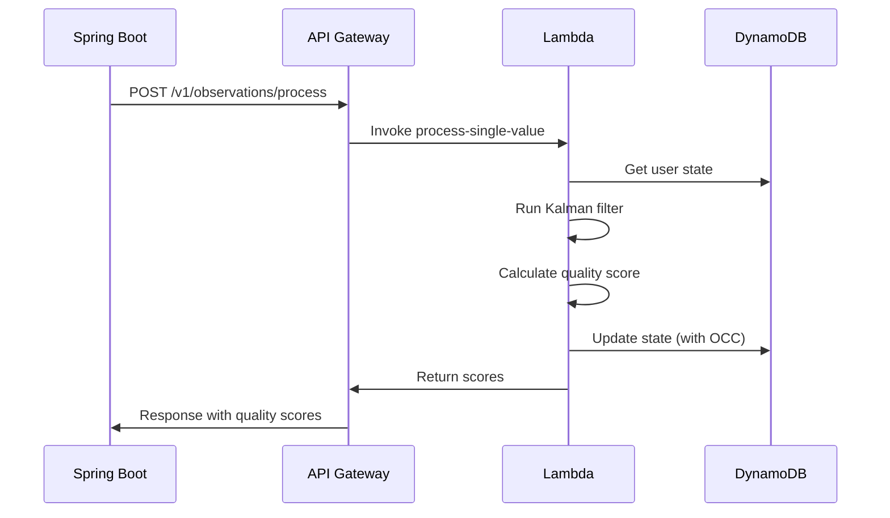
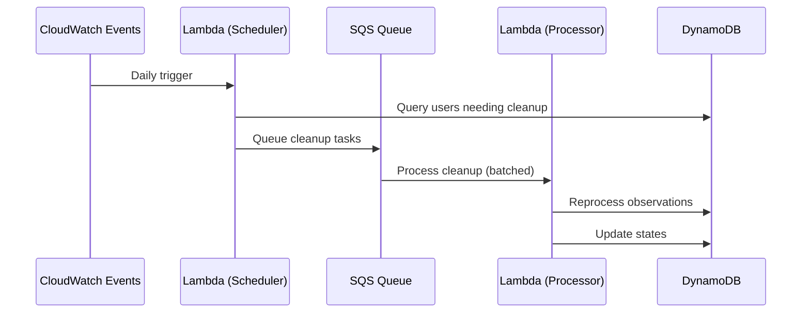

# AWS Lambda API Architecture for Weight Processing Service

## Executive Summary

This document outlines the serverless architecture for exposing the weight processing system as an API service for a Java Spring Boot backend. The design prioritizes scalability, reliability, and cost-effectiveness while maintaining the statistical integrity of the Kalman filtering system.

## Architecture Overview

### Core Components

```
┌─────────────────────────────────────────────────────────────┐
│                    Java Spring Boot Backend                  │
│                         (AWS Hosted)                         │
└────────────┬────────────────────────────┬───────────────────┘
             │                            │
             ▼                            ▼
    ┌────────────────┐          ┌────────────────┐
    │  API Gateway   │          │  API Gateway   │
    │   (REST API)   │          │  (WebSocket)   │
    └────────┬────────┘          └────────┬────────┘
             │                            │
             ▼                            ▼
    ┌────────────────────────────────────────────┐
    │           Lambda Function Layer             │
    ├──────────────────────────────────────────────┤
    │ • process-observations (unified)           │
    │ • verify-observations                      │
    │ • cleanup (unified)                        │
    └────────────────┬────────────────────────────┘
                     │
         ┌───────────┴───────────┐
         ▼                       ▼
    ┌─────────────┐      ┌──────────────┐
    │  DynamoDB   │      │     SQS      │
    │   (State)   │      │   (Async)    │
    └─────────────┘      └──────────────┘
```

## API Endpoints

### 1. Process Observations (Unified)
**POST** `/v1/observations/process`

Process single or multiple weight measurements. Automatically detects batch vs single based on request structure.

#### Batch Observations Request:
```json
{
  "observations": [ // one or more
    {
      "user_id": "d170e575-17eb-4679-b17c-35be3d65653f",
      "effectiveDateTime": "2024-02-25 14:30:00",
      "source_type": "patient-device",
      "weight": 75.5,
      "unit": "kg",
      "observation_id": "obs-123456"
    },
    {
      "user_id": "d170e575-17eb-4679-b17c-35be3d65653f",
      "effectiveDateTime": "2024-02-26 08:00:00",
      "source_type": "care-team-upload",
      "weight": 74.8,
      "unit": "kg",
      "observation_id": "obs-123457"
    }
  ],
  "height": 175  // optional, applies to all observations
}
```

#### Success Response (200 OK):

**All observations accepted:**
```json
{
  "status": "success",
  "results": {
    "obs-123456": {
      "quality_score": 0.85,
      "observation_status": "final",
      "is_outlier": false,
      "kalman_estimate": 75.3,
      "confidence": 0.92,
      "metadata": {
        "processed_at": "2024-02-25T14:30:05Z",
        "processor_version": "1.0.0"
      }
    }
  },
  "correlation_id": "req-7f3a2b1c-8d9e-4f5a-b6c7-1e2d3f4a5b6c"
}
```

**With rejected observations (still 200 OK):**
```json
{
  "status": "success",
  "results": {
    "obs-123456": {
      "quality_score": 0.12,
      "observation_status": "entered-in-error",
      "is_outlier": true,
      "is_rejected": true,
      "rejection_reason": "extreme_outlier",
      "kalman_estimate": 75.3,
      "confidence": 0.92
    },
    "obs-123457": {
      "quality_score": 0.95,
      "observation_status": "final",
      "is_outlier": false,
      "is_rejected": false,
      "kalman_estimate": 75.1,
      "confidence": 0.94
    },
    "obs-123458": {
      "quality_score": 0.08,
      "observation_status": "entered-in-error",
      "is_outlier": true,
      "is_rejected": true,
      "rejection_reason": "physiologically_impossible",
      "details": {
        "weight": 15.0,
        "calculated_bmi": 4.9
      }
    }
  },
  "summary": {
    "total": 3,
    "accepted": 1,
    "rejected": 2
  },
  "correlation_id": "req-7f3a2b1c-8d9e-4f5a-b6c7-1e2d3f4a5b6c"
}
```

#### Error Responses:

**400 Bad Request - Invalid Request Format:**
```json
{
  "status": "error",
  "error_code": "INVALID_REQUEST",
  "message": "Request format is invalid",
  "details": {
    "user_id": "Required field missing",
    "effectiveDateTime": "Invalid datetime format, expected YYYY-MM-DD HH:MM:SS"
  },
  "correlation_id": "req-7f3a2b1c-8d9e-4f5a-b6c7-1e2d3f4a5b6c"
}
```

**409 Conflict - Outdated Observation:**
```json
{
  "status": "error",
  "error_code": "OBSERVATION_OUTDATED",
  "message": "Observation datetime is older than latest processed state",
  "details": {
    "observation_timestamp": "2024-02-20T10:00:00Z",
    "latest_processed_timestamp": "2024-02-25T14:30:00Z",
    "user_id": "d170e575-17eb-4679-b17c-35be3d65653f",
    "required_action": "full_cleanup"
  },
  "correlation_id": "req-7f3a2b1c-8d9e-4f5a-b6c7-1e2d3f4a5b6c"
}
```


**500 Internal Server Error:**
```json
{
  "status": "error",
  "error_code": "INTERNAL_ERROR",
  "message": "An unexpected error occurred during processing",
  "correlation_id": "req-7f3a2b1c-8d9e-4f5a-b6c7-1e2d3f4a5b6c",
  "retry_after": "2024-02-25T14:35:00Z"
}
```

**503 Service Unavailable:**
```json
{
  "status": "error",
  "error_code": "SERVICE_UNAVAILABLE",
  "message": "Service temporarily unavailable due to maintenance or overload",
  "correlation_id": "req-7f3a2b1c-8d9e-4f5a-b6c7-1e2d3f4a5b6c",
  "retry_after": "2024-02-25T14:35:00Z"
}
```

#### Partial Success Response (207 Multi-Status) - Batch Only:
When some observations encounter errors (not rejections) while others succeed:

```json
{
  "status": "partial_success",
  "message": "3 of 5 observations processed, 2 failed",
  "results": {
    "obs-123456": {
      "status": "success",
      "quality_score": 0.85,
      "observation_status": "final",
      "is_outlier": false,
      "is_rejected": false
    },
    "obs-123457": {
      "status": "error",
      "error_code": "OBSERVATION_OUTDATED",
      "message": "Datetime older than latest state",
      "details": {
        "observation_timestamp": "2024-02-20T10:00:00Z",
        "latest_processed_timestamp": "2024-02-25T14:30:00Z"
      }
    },
    "obs-123458": {
      "status": "success",
      "quality_score": 0.12,
      "observation_status": "entered-in-error",
      "is_outlier": true,
      "is_rejected": true,
      "rejection_reason": "extreme_outlier"
    },
    "obs-123459": {
      "status": "error",
      "error_code": "USER_NOT_FOUND",
      "message": "No state found for user",
      "details": {
        "user_id": "unknown-user-id"
      }
    },
    "obs-123460": {
      "status": "success",
      "quality_score": 0.92,
      "observation_status": "final",
      "is_outlier": false,
      "is_rejected": false
    }
  },
  "summary": {
    "total": 5,
    "processed": 3,
    "accepted": 2,
    "rejected": 1,
    "errors": 2
  },
  "correlation_id": "req-7f3a2b1c-8d9e-4f5a-b6c7-1e2d3f4a5b6c"
}
```

### 2. Verify Observations
**POST** `/v1/observations/verify`

Check if observations can be processed or require cleanup. Supports both single and batch verification.

#### Request:
Same request format as `/v1/observations/process` endpoint (single observation or batch)

#### Batch Observations Request:
```json
{
  "observations": [ // one or more
    {
      "user_id": "d170e575-17eb-4679-b17c-35be3d65653f",
      "effectiveDateTime": "2024-02-25 14:30:00",
      "source_type": "patient-device",
      "weight": 75.5,
      "unit": "kg",
      "observation_id": "obs-123456"
    },
    {
      "user_id": "d170e575-17eb-4679-b17c-35be3d65653f",
      "effectiveDateTime": "2024-02-20 10:00:00",
      "source_type": "care-team-upload",
      "weight": 74.8,
      "unit": "kg",
      "observation_id": "obs-123457"
    }
  ]
}
```

#### Success Response - All Can Process (200 OK):
```json
{
  "status": "success",
  "results": {
    "obs-123456": {
      "can_process": true,
      "requires_cleanup": false
    },
    "obs-123457": {
      "can_process": true,
      "requires_cleanup": false
    }
  },
  "summary": {
    "total": 2,
    "can_process": 2,
    "requires_cleanup": 0
  },
  "correlation_id": "req-7f3a2b1c-8d9e-4f5a-b6c7-1e2d3f4a5b6c"
}
```

#### Mixed Response - Some Need Cleanup (200 OK):
```json
{
  "status": "success",
  "results": {
    "obs-123456": {
      "can_process": true,
      "requires_cleanup": false
    },
    "obs-123457": {
      "can_process": false,
      "requires_cleanup": true,
      "reason": "OBSERVATION_OUTDATED",
      "message": "Observation datetime is older than latest processed state",
      "details": {
        "observation_timestamp": "2024-02-20T10:00:00Z",
        "latest_processed_timestamp": "2024-02-25T14:30:00Z"
      }
    },
    "obs-123458": {
      "can_process": false,
      "requires_cleanup": true,
      "reason": "NO_USER_STATE",
      "message": "User has never been processed, requires full cleanup"
    }
  },
  "summary": {
    "total": 3,
    "can_process": 1,
    "requires_cleanup": 2
  },
  "correlation_id": "req-7f3a2b1c-8d9e-4f5a-b6c7-1e2d3f4a5b6c"
}
```

### 3. Cleanup
**POST** `/v1/cleanup`

Trigger cleanup for a user. Can be scheduled (specific date range) or full (all historical data).

#### Request - Recent Cleanup (date range):
```json
{
  "user_id": "d170e575-17eb-4679-b17c-35be3d65653f",
  "cleanup_type": "recent",
  "start_date": "2024-02-20T00:00:00Z",  // Required for recent
  "end_date": "2024-02-25T23:59:59Z"     // Required for recent
}
```

#### Request - Full Cleanup (all history):
```json
{
  "user_id": "d170e575-17eb-4679-b17c-35be3d65653f",
  "cleanup_type": "full",
  "reason": "migration"  // Optional: "migration", "error_recovery", "manual"
}
```

#### Success Response (202 Accepted):
```json
{
  "status": "accepted",
  "cleanup_id": "cleanup-789",
  "cleanup_type": "full",
  "message": "Cleanup task queued for processing",
  "estimated_completion": "2024-02-25T15:00:00Z",
  "correlation_id": "req-7f3a2b1c-8d9e-4f5a-b6c7-1e2d3f4a5b6c"
}
```

#### Error Response (400 Bad Request):
```json
{
  "status": "error",
  "error_code": "INVALID_DATE_RANGE",
  "message": "Start and end dates are required for recent cleanup type",
  "correlation_id": "req-7f3a2b1c-8d9e-4f5a-b6c7-1e2d3f4a5b6c"
}
```

#### Error Response (404 Not Found):
```json
{
  "status": "error",
  "error_code": "USER_NOT_FOUND",
  "message": "No data found for user",
  "details": {
    "user_id": "d170e575-17eb-4679-b17c-35be3d65653f"
  },
  "correlation_id": "req-7f3a2b1c-8d9e-4f5a-b6c7-1e2d3f4a5b6c"
}
```

#### Error Response (429 Too Many Requests):
```json
{
  "status": "error",
  "error_code": "CLEANUP_IN_PROGRESS",
  "message": "A cleanup task is already running for this user",
  "details": {
    "existing_cleanup_id": "cleanup-123",
    "existing_cleanup_type": "full",
    "started_at": "2024-02-25T14:00:00Z"
  },
  "retry_after": "2024-02-25T16:00:00Z",
  "correlation_id": "req-7f3a2b1c-8d9e-4f5a-b6c7-1e2d3f4a5b6c"
}
```

## State Management Strategy

### DynamoDB Schema

**Table: weight-processor-states**

| Attribute | Type | Description |
|-----------|------|-------------|
| user_id (PK) | String | User UUID |
| state_version | Number | Optimistic locking version |
| last_processed | String | ISO timestamp of last processing |
| kalman_state | Map | Serialized Kalman filter state |
| measurement_buffer | List | Last 30 measurements |
| reset_events | List | History of filter resets |
| metadata | Map | Processing metadata |

**GSI: by-last-processed**
- Partition Key: processing_date (YYYY-MM-DD)
- Sort Key: last_processed
- Used for scheduled cleanup queries

### State Consistency Model

```python
# Optimistic Concurrency Control
def update_state(user_id, new_state, expected_version):
    try:
        dynamodb.update_item(
            Key={'user_id': user_id},
            UpdateExpression='SET kalman_state = :state, state_version = :new_version',
            ExpressionAttributeValues={
                ':state': new_state,
                ':new_version': expected_version + 1,
                ':expected': expected_version
            },
            ConditionExpression='state_version = :expected'
        )
    except ConditionalCheckFailed:
        # Retry with fresh state
        current = get_state(user_id)
        return reprocess_with_current_state(current)
```

## Processing Flows

### 1. New Observation Flow



### 2. Cleanup Flow (Async)



## Error Handling

### Standard Error Response Format

All error responses follow a consistent structure:

```json
{
  "status": "error",
  "error_code": "SPECIFIC_ERROR_CODE",
  "message": "Human-readable error message",
  "details": {
    // Error-specific details
  },
  "correlation_id": "req-uuid",
  "retry_after": "ISO-8601 timestamp"  // Optional
}
```

### Error Code Reference

| Code | HTTP Status | Description | Retry Strategy |
|------|-------------|-------------|----------------|
| INVALID_REQUEST | 400 | Request format invalid | Fix request structure |
| INVALID_DATE_RANGE | 400 | Date range is invalid | Fix date parameters |
| USER_NOT_FOUND | 404 | User has no data | No retry |
| OBSERVATION_OUTDATED | 409 | Datetime older than latest state | Trigger full cleanup |
| CLEANUP_IN_PROGRESS | 429 | Cleanup already running | Wait and retry |
| INTERNAL_ERROR | 500 | Server processing error | Exponential backoff |
| SERVICE_UNAVAILABLE | 503 | Temporary unavailability | Linear backoff |

### Error Handling Patterns

1. **Observation Older Than Latest State**
   - Return 409 Conflict with OBSERVATION_OUTDATED code
   - Include timestamps for debugging
   - Spring Boot decides whether to save anyway or trigger cleanup

2. **Batch Processing Errors**
   - Return 207 Multi-Status for partial success
   - Each observation gets individual status
   - Summary statistics for monitoring

3. **State Corruption Recovery**
   - Automatic recovery attempt with state validation
   - Fallback to last known good state
   - Alert monitoring and trigger full cleanup if needed

4. **Lambda Timeout Protection**
   - 30-second timeout with 5-second buffer for response
   - Idempotent processing with correlation IDs
   - SQS retry with exponential backoff (2, 4, 8, 16 seconds)
   - Dead letter queue after 3 retries

## Deployment Strategy

### Infrastructure as Code (AWS CDK)

```python
# cdk_stack.py outline
class WeightProcessorStack(Stack):
    def __init__(self):
        # API Gateway
        self.api = RestApi(self, "WeightProcessorAPI",
            rest_api_name="weight-processor",
            deploy_options=DeployOptions(
                throttling_rate_limit=1000,
                throttling_burst_limit=2000
            ))

        # Lambda Functions
        self.process_function = Function(self, "ProcessFunction",
            runtime=Runtime.PYTHON_3_11,
            handler="lambda_handlers.process_single_value",
            timeout=Duration.seconds(30),
            memory_size=512,
            reserved_concurrent_executions=100)

        # DynamoDB Table
        self.state_table = Table(self, "StateTable",
            partition_key=Attribute(name="user_id", type=AttributeType.STRING),
            billing_mode=BillingMode.PAY_PER_REQUEST,
            point_in_time_recovery=True)

        # SQS Queue for async processing
        self.cleanup_queue = Queue(self, "CleanupQueue",
            visibility_timeout=Duration.minutes(15),
            dead_letter_queue=DeadLetterQueue(
                max_receive_count=3,
                queue=Queue(self, "CleanupDLQ")))
```

### Environment Configuration

```toml
# config/production.toml
[api]
rate_limit = 1000
burst_limit = 2000
timeout_seconds = 30

[dynamodb]
read_capacity = 100  # If provisioned
write_capacity = 100
enable_streams = true
stream_view_type = "NEW_AND_OLD_IMAGES"

[lambda]
memory_mb = 512
timeout_seconds = 30
reserved_concurrency = 100
enable_xray = true

[monitoring]
enable_cloudwatch = true
alarm_threshold_errors = 10
alarm_threshold_latency_ms = 5000
```

## Performance Considerations

### Lambda Optimization

1. **Cold Start Mitigation**
   - Provisioned concurrency for critical endpoints
   - Lightweight dependencies (no pandas/numpy if possible)
   - Connection pooling for DynamoDB

2. **Memory and CPU**
   - 512MB base allocation
   - Auto-scale to 3008MB for batch processing
   - CPU scales linearly with memory

3. **Batching Strategy**
   - Process up to 25 observations per batch
   - Use SQS batch processing (10 messages)
   - Aggregate DynamoDB writes

### Cost Optimization

```python
# Estimated Monthly Costs (10,000 users, 5 observations/day)
lambda_invocations = 10000 * 5 * 30 = 1,500,000
lambda_cost = 1500000 * 0.0000002 = $0.30

dynamodb_writes = 1500000 * 0.00000125 = $1.88
dynamodb_reads = 1500000 * 0.00000025 = $0.38
dynamodb_storage = 10000 * 0.01GB * 0.25 = $25.00

api_gateway = 1500000 * 0.000001 = $1.50

total_monthly = ~$30
```

## Security Considerations

### Authentication & Authorization
- API Gateway with AWS IAM authentication
- Spring Boot service assumes AWS IAM role
- Resource-based policies for Lambda invocation

### Data Protection
- Encryption at rest (DynamoDB, SQS)
- Encryption in transit (TLS 1.2+)
- No PII in CloudWatch logs
- VPC endpoints for AWS services

### Compliance
- HIPAA compliance through AWS BAA
- Audit trails via CloudTrail
- Data retention policies (90 days)

## Integration Guide for Spring Boot

### Client Configuration

```java
// WeightProcessorClient.java
@Component
public class WeightProcessorClient {
    private final AmazonApiGateway apiGateway;
    private final String apiEndpoint;

    public QualityScoreResponse processObservation(Observation obs) {
        ProcessRequest request = ProcessRequest.builder()
            .userId(obs.getUserId())
            .effectiveDateTime(obs.getEffectiveDateTime())
            .sourceType(obs.getSourceType())
            .weight(obs.getWeight())
            .unit(obs.getUnit())
            .observationId(obs.getId())
            .build();

        return apiGateway.post("/v1/observations/process", request);
    }

    @Async
    public CompletableFuture<CleanupResponse> scheduleCleanup(String userId) {
        CleanupRequest request = CleanupRequest.builder()
            .userId(userId)
            .cleanupType("recent")
            .build();

        return apiGateway.postAsync("/v1/cleanup/scheduled", request);
    }
}
```

### Error Handling

```java
// ObservationService.java
public void saveObservation(Observation obs) {
    try {
        QualityScoreResponse response = weightProcessorClient.processObservation(obs);

        if (response.isOutlier()) {
            obs.setStatus(ObservationStatus.ENTERED_IN_ERROR);
        } else {
            obs.setStatus(ObservationStatus.FINAL);
        }
        obs.setQualityScore(response.getQualityScore());

    } catch (EffectiveDateTimeOlderException e) {
        // Save anyway but flag for cleanup
        obs.setStatus(ObservationStatus.PRELIMINARY);
        obs.setRequiresCleanup(true);
        scheduleFullCleanup(obs.getUserId());

    } catch (WeightProcessorException e) {
        // Log and save with unknown quality
        log.error("Weight processor error", e);
        obs.setQualityScore(null);
    }

    observationRepository.save(obs);
}
```

## Monitoring & Observability

### Key Metrics
- Lambda invocation count and duration
- API Gateway 4xx/5xx errors
- DynamoDB throttles and system errors
- SQS message age and DLQ depth
- Quality score distribution
- Outlier detection rate

### Alarms
```yaml
alarms:
  - name: HighErrorRate
    metric: 4XXError
    threshold: 10
    period: 300

  - name: ProcessingLatency
    metric: Duration
    threshold: 5000
    period: 60

  - name: DLQDepth
    metric: ApproximateNumberOfMessagesVisible
    threshold: 100
    period: 300
```

### Dashboards
- Real-time processing metrics
- User state distribution
- Quality score trends
- Source reliability analysis

## Migration Plan

### Phase 1: Setup Infrastructure
- Deploy DynamoDB tables
- Deploy Lambda functions
- Configure API Gateway
- Set up monitoring

### Phase 2: Integration
- Update Spring Boot with client library
- Add feature flags for gradual rollout
- Implement fallback mechanisms

### Phase 3: Migration
- Batch process historical data
- Validate quality scores
- Enable real-time processing

### Phase 4: Optimization
- Tune Lambda configurations
- Optimize batch sizes
- Implement caching strategies

## Open Questions & Decisions Needed

1. **Historical Data Loading**
   - How will Spring Boot provide historical observations for full cleanup?
   - Should we maintain a separate observation store or query Spring Boot?

2. **Notification System**
   - How should we notify Spring Boot when async cleanup completes?
   - WebSocket, SNS, or polling?

3. **Multi-Region Strategy**
   - Single region with global accelerator?
   - Multi-region with DynamoDB Global Tables?

4. **Rate Limiting**
   - Per-user rate limits?
   - Organization-level quotas?

5. **Versioning Strategy**
   - API versioning approach (URL vs header)
   - Backward compatibility requirements

## Next Steps

1. Review and approve architecture with team
2. Finalize API contracts with Spring Boot team
3. Set up AWS accounts and permissions
4. Begin CDK/SAM template development
5. Create integration test environment
6. Develop client SDK for Spring Boot
